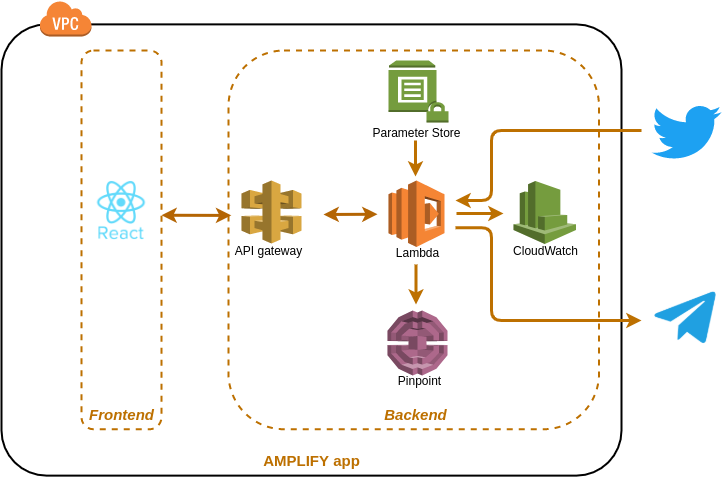

**eFascia** is an analytics enabled generic reporting platform. It is currently equipped to display tweets for a hashtag that the user searches for. The search results will also get streamed to a configured telegram channel.

**Features**
- Encryption at rest and transit
- Analytics enabled backend
- Mobile notification enabled

**Demo**

**Steps to run:**
###### Local:
- amplify push --y
- yarn install
- yarn start
###### Remote:
- Clone the remote and push to your repo.
- Configure the amplify console to fetch the source code from your repo.

**Technologies:**
- UI/UX: SASS
- Front end: React
- Backend: Nodejs
- Communication: REST
- Third party applications: Twitter
- Cloud provider: AWS with amplify
- Analytics provider: AWS Pinpoint
- Mobility provider: Telegram

**Libraries**
- Charts:  recharts
- Spinner: react-spinners
- Twitter client: twitter-api-client

**Architecture:**  

**Product Notes:**  
The dashboard page is a placeholder to showcas the capabilities of the product.
The Tweets page can (as of now) fetch only tweets corresponding to a hashtag.
The abouts page is a placeholder as well.
The styling is kept basic as this is a generic product without a theme. The product can easily be styled according to a theme to which this product will be customized.

**Developer Support:**
###### Amplify authentication theming
https://docs.amplify.aws/ui/customization/theming/q/framework/react/

###### Styles support
https://www.bootdey.com/snippets/view/General-Search-Results#preview

*Note: If you find any UX bugs please raise an issue in this repo. This repo currently caters to the happy flow. More is on the way!!!!*